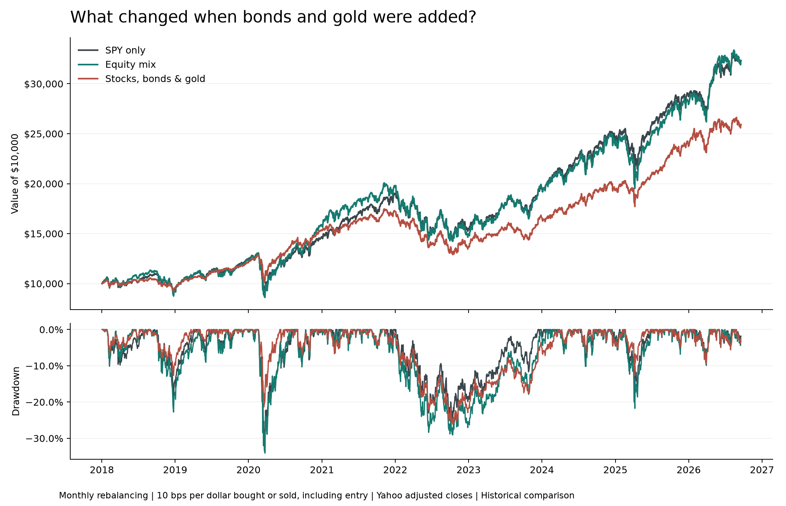

# Market Risk Research Project

A Python and SQL analysis of how adding bonds and gold changes the risk of an equity portfolio.

[Open the dashboard](dashboard/index.html) | [One-page findings brief](results/findings_brief.pdf) | [Power BI project](powerbi/Market%20Risk%20Research.pbip)



## Question And Findings

How did adding long-term US Treasury bonds and gold change portfolio risk and return?

The default sample is 2 January 2018 to 18 September 2026, with 2,189 daily returns per asset.
Three fixed allocations are compared, with monthly rebalancing and a cost of 10 basis points
(0.10%) per dollar bought or sold, including the initial purchase.

| Portfolio | Target weights | Annualized return | Volatility | Max drawdown |
| --- | --- | ---: | ---: | ---: |
| SPY only | 100% SPY | 14.5% | 19.0% | -33.7% |
| Equity mix | One-third each SPY, QQQ, IWM | 14.4% | 21.2% | -34.1% |
| Stocks, bonds & gold | 20% each SPY, QQQ, IWM, TLT, GLD | 11.6% | 13.6% | -26.1% |

The diversified mix had 35.6% lower annualized volatility than the equity mix, but also a lower
annualized return. It still lost 20.8% during 2022. Diversification changed the risk profile;
it did not remove the possibility of substantial losses.

These figures describe the included snapshot and assumptions. The [generated findings](results/findings_brief.md)
and [CSV metrics](results/portfolio_summary.csv) update when the script is rerun. The summary above
is a publication snapshot, not a live market feed.

## Explore

Open `dashboard/index.html` in a browser. It works directly from disk, without a server,
Python installation, internet connection or account.

- Portfolio view: date ranges, monthly versus buy-and-hold, 0/10/25-bps costs, growth, drawdown and CSV export.
- Asset view: ETF selection, performance, return correlation, risk metrics and SQL monthly returns.
- Data and method view: quality checks, retained outliers, assumptions and links to research files.

The asset tab is before trading costs. The portfolio tab uses the selected cost assumptions.
Subperiod charts start at $10,000 but keep the portfolio's earlier holdings. The calendar heatmap
and fixed historical-period table have their own explicitly labelled coverage.

The native Power BI project has a portfolio comparison page and a SQL/data-quality page.
It contains an embedded source snapshot, a date/portfolio data model and DAX measures.
Its report JSON passes Microsoft's published schemas, but **it has not been opened or executed in
Power BI Desktop**, which is not installed on the build machine. See [Power BI instructions](powerbi/README.md).
The browser dashboard is the version that has been tested end to end.

## Workflow

1. Download Yahoo Finance daily adjusted closes and preserve the raw responses with source URLs and hashes.
2. Check dates, duplicates, missing/nonfinite/nonpositive prices and unusually large daily returns.
3. Load accepted prices and asset metadata into SQLite.
4. Calculate returns, monthly performance, worst days and rankings with SQL.
5. Check daily SQL returns against pandas and calculate risk metrics.
6. Simulate fixed portfolios with drifting weights, explicit rebalancing and costs.
7. Generate charts, the offline dashboard, a PDF brief and the Power BI source project.

This covers Python, pandas, SQL joins and window functions, data validation, portfolio arithmetic,
visual reporting and written interpretation. [The SQL walkthrough](SQL_WALKTHROUGH.md) explains the queries.

## Reproduce

Python 3.11 or newer is required to rebuild the outputs. From this folder:

```powershell
python -m pip install -r requirements.txt
python market_risk_snapshot.py
```

The first run downloads prices. Later runs reuse the saved source snapshot.

```powershell
python market_risk_snapshot.py --offline
python market_risk_snapshot.py --refresh
python market_risk_snapshot.py --start 2020-01-01 --end 2026-09-18 --refresh
python run_sql.py sql/03_worst_days.sql
```

A refresh replaces the saved local snapshot and regenerates results, including the LinkedIn draft
and native Power BI project. Keep a separate copy of any edits to those generated files.
Historical adjusted prices can be revised by Yahoo. Exact numerical reproduction needs the matching
raw snapshot; new downloads may differ. Source hashes, dates and package versions are in
[run_metadata.json](results/run_metadata.json).

## Assumptions And Limits

- Prices: Yahoo adjusted closes in USD, used as supplied. The ETF universe was chosen for this project.
- Quality: missing sessions or conflicting duplicates block analysis. No prices are filled.
  The observed-date check cannot detect a session missing from every source.
- Outliers: absolute daily moves of 10% or more are flagged and retained. They have not been independently
  verified; a structural pass is not a guarantee of accurate vendor data.
- Rebalancing: fixed target weights reset before the first return in each new calendar month.
  Between resets, weights drift. Only past holdings determine the next rebalance.
- Costs: charged on the sum of amounts bought and sold, including initial investment from cash.
  No final liquidation, taxes, slippage beyond the chosen cost, or market impact.
- Metrics: 252 trading days per year; sample standard deviation; compounded annualized return.
  Sharpe uses mean daily excess return, an assumed 0% risk-free rate and sqrt(252) scaling.
  Drawdown includes the starting investment and resets its peak for a selected subperiod.
- Period comparisons: descriptive, with a hindsight-selected 2020 sell-off window.
  Fixed allocations are not optimized, and this is not an out-of-sample predictive test.
- Legacy risk report: its equal-weight portfolio is a separate daily-rebalanced, zero-cost reference.
  The dashboard and findings brief use the monthly-rebalanced, 10-bps comparison by default.
- VaR/CVaR: one-day, 95% historical measures. The legacy Monte Carlo estimate uses 20,000 normal
  draws and seed 42; a normal distribution can understate extreme losses.

## Validation

```powershell
python -m unittest discover -s tests -v
```

The 30 Python tests cover missing data, duplicates, invalid prices, snapshot integrity,
SQL compounding, Sharpe, drawdown, drifting weights, cost arithmetic and absence of future-data
dependence in earlier portfolio results.

Optional checks:

```powershell
python -m pip install -r requirements-dev.txt
python tools/validate_powerbi.py
npm install
npm run test:dashboard
```

The browser tests use Playwright with Microsoft Edge by default. Set `BROWSER_CHANNEL=chrome`
to use an installed Chrome instead. They compare 90 scenario metrics with Python, check filters,
CSV export, print, invalid ranges, links and nonblank charts at desktop and mobile widths.
The dashboard makes no external network requests.

Power BI validation checks 16 JSON files against Microsoft schemas, verifies field and relationship
references, and checks that report visuals fit without overlapping. It does not execute DAX or
Power Query. Desktop refresh and visual checks remain necessary.

## Project Files

| File or folder | Purpose |
| --- | --- |
| `market_risk_snapshot.py` | Main command, asset risk metrics and original charts |
| `data_pipeline.py` | Downloads, raw snapshots, validation, database and SQL exports |
| `portfolio_analysis.py` | Rebalancing, transaction costs, period comparison and dashboard data |
| `build_deliverables.py` | Findings brief, PDF and LinkedIn draft |
| `build_powerbi.py` | Native Power BI model and report definitions |
| `sql/` | Schema and four analysis queries |
| `dashboard/` | Offline dashboard and locally bundled libraries |
| `powerbi/` | Native project, measures, opening instructions and validation result |
| `results/` | Charts, small CSV outputs, dashboard preview and reports |
| `tests/` | Python regression tests and browser checks |
| `SHARING.md` | What to upload and how to present the work |

The raw responses, local SQLite database, intermediate daily/rolling CSVs, browser QA screenshots,
Power BI caches and downloaded schema caches are excluded from the GitHub ZIP.
The dashboard data and embedded Power BI snapshot are included so reviewers can inspect the results.
Vendored Chart.js and Lucide retain their licences in `dashboard/vendor/`.

## Contributors

- Alan Sieprawski - analysis, implementation, and interpretation
- Conor McMillan - project contributor

## References

- [William F. Sharpe, The Sharpe Ratio](https://web.stanford.edu/~wfsharpe/art/sr/sr.htm)
- [SQLite window functions](https://www.sqlite.org/windowfunctions.html)
- [Microsoft: Power BI project report format](https://learn.microsoft.com/en-us/power-bi/developer/projects/projects-report)
- [Microsoft: Power BI semantic model format](https://learn.microsoft.com/en-us/power-bi/developer/projects/projects-dataset)
